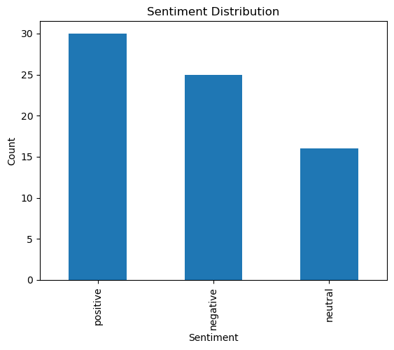

# 🍽️ Sentiment Analysis of Restaurant Reviews (Majhitar, Sikkim)

## 📌 Project Overview

This project focuses on analyzing customer reviews of restaurants in Majhitar, Sikkim using Natural Language Processing (NLP) techniques.
The goal is to classify reviews into **Positive, Neutral, or Negative sentiments** and evaluate model performance.

---

## 🚀 Live Demo

👉 **Try the app here:**
🔗[ https://your-streamlit-app-link.streamlit.app](https://sentiment-analysis-majhitar-rt6lcycxzndimdes9rwqca.streamlit.app)

*(Replace this with your actual deployed link)*

---

## 🚀 Features

* Text preprocessing (cleaning, stopword removal)
* TF-IDF vectorization
* Logistic Regression model
* Model evaluation (Accuracy, Precision, Recall, F1-score)
* Confusion Matrix visualization
* Streamlit-based web application
* Real-time sentiment prediction

---

## 🧠 Tech Stack

* Python
* Pandas, NumPy
* Scikit-learn
* NLTK
* Matplotlib
* Streamlit

---

## 📂 Project Structure

```
SENTIMENT-ANALYSIS-MAJOR
├── app/
│   └── app.py                 # Streamlit UI
├── data/
│   └── reviews.csv           # Dataset
├── models/
│   └── model.pkl             # Trained model
├── notebooks/
│   └── analysis.ipynb        # EDA & visualization
├── outputs/
│   ├── results.txt           # Evaluation results
│   └── Sentiment_Distribution.png  # Graphs
├── src/
│   ├── preprocess.py         # Data cleaning
│   ├── train.py              # Model training
│   └── evaluate.py           # Evaluation
├── README.md
├── report.docx
└── requirements.txt
```

---

## ⚙️ Installation

Clone the repository:

```bash
git clone https://github.com/your-username/sentiment-analysis-majhitar.git
cd sentiment-analysis-majhitar
```

Install dependencies:

```bash
pip install -r requirements.txt
```

---

## ▶️ How to Run

### 1️⃣ Train the Model

```bash
PYTHONPATH=. python src/train.py
```

### 2️⃣ Evaluate the Model

```bash
PYTHONPATH=. python src/evaluate.py
```

### 3️⃣ Run Streamlit App

```bash
streamlit run app/app.py
```

---

## 📊 Model Performance

* **Accuracy:** ~46% (depends on dataset size)
* **Model:** Logistic Regression
* **Feature Extraction:** TF-IDF

---

## 📈 Outputs & Results

### 🔹 Evaluation Results

You can find detailed evaluation metrics inside:

```
outputs/results.txt
```

### 🔹 Sentiment Distribution Graph



---

## 🧪 Example Predictions

| Review                   | Predicted Sentiment |
| ------------------------ | ------------------- |
| Amazing food and service | 😊 Positive         |
| It was okay              | 😐 Neutral          |
| Very bad experience      | 😡 Negative         |

---

## ⚠️ Challenges Faced

* Class imbalance in dataset
* Path issues during deployment
* Module import errors
* Model loading errors (pickle)
* Handling missing files in production

---

## 🌐 Deployment

The application is deployed using **Streamlit Cloud**.
👉 Access it here: https://your-streamlit-app-link.streamlit.app

---

## 🎯 Learning Outcomes

* Built an end-to-end ML pipeline
* Learned NLP preprocessing techniques
* Understood feature engineering (TF-IDF)
* Gained hands-on experience in deployment
* Improved debugging and problem-solving skills

---

## 🔮 Future Improvements

* Use advanced models (LSTM / BERT)
* Increase dataset size
* Hyperparameter tuning
* Deploy using FastAPI + React (SaaS level)

---

## 👨‍💻 Author

**Shalini Saurav**

---

## ⭐ Support

If you like this project, consider giving it a ⭐ on GitHub!

---

## 📸 Screenshots


---

💡 **Tip:** Once you deploy your Streamlit app, just replace the demo link above — that alone makes your project look 10x more professional on GitHub and during placements.
