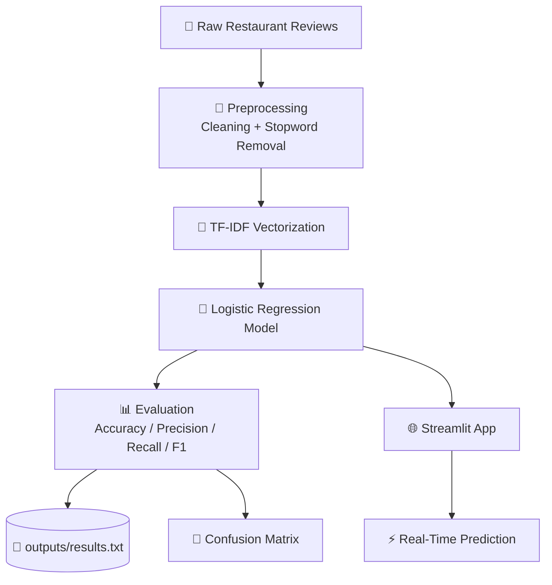
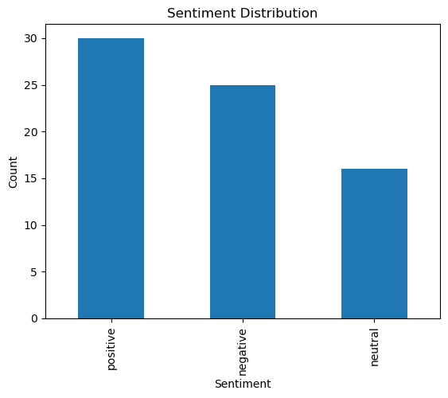
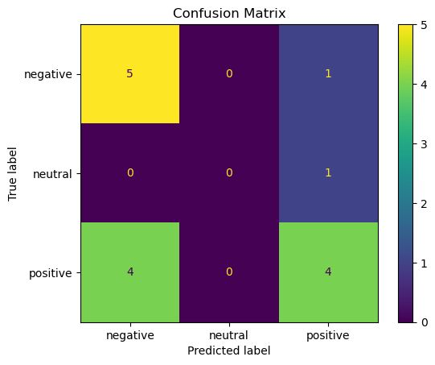
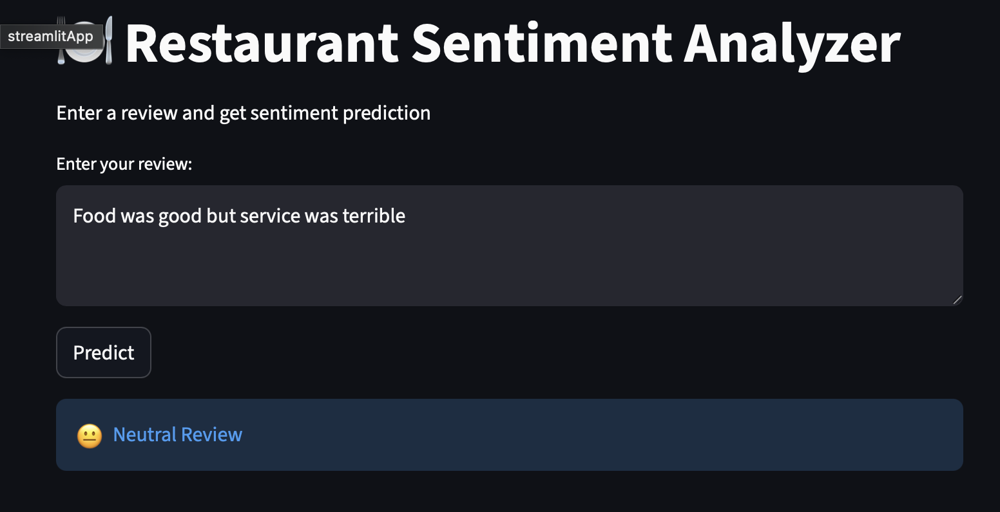

<div align="center">

# 🍽️ Sentiment Analysis of Restaurant Reviews
### *Majhitar, Sikkim*

**Decoding what diners really think — one review at a time.**

A Natural Language Processing project that reads customer reviews of restaurants in Majhitar, Sikkim, and classifies them as **Positive 😊, Neutral 😐, or Negative 😡** — turning scattered opinions into structured, actionable insight.

<br>


<br>

[**🌐 Live Demo**](https://sentiment-analysis-majhitar-rt6lcycxzndimdes9rwqca.streamlit.app) &nbsp;•&nbsp; [**📁 GitHub Repository**](https://github.com/SHALINISAURAV/sentiment-analysis-majhitar) &nbsp;•&nbsp; [**📄 Project Report**](report.pdf)

</div>

<br>

---

## 📚 Table of Contents

- [Project Overview](#-project-overview)
- [Why This Project?](#-why-this-project)
- [Live Demo](#-live-demo)
- [Features](#-features)
- [System Pipeline](#️-system-pipeline)
- [Tech Stack](#-tech-stack)
- [Project Structure](#-project-structure)
- [Installation](#️-installation)
- [How to Run](#️-how-to-run)
- [Model Performance](#-model-performance)
- [Outputs & Results](#-outputs--results)
- [Example Predictions](#-example-predictions)
- [App Screenshot](#-app-screenshot)
- [Challenges Faced](#️-challenges-faced)
- [Deployment](#-deployment)
- [Learning Outcomes](#-learning-outcomes)
- [Future Improvements](#-future-improvements)
- [Author](#-author)
- [Support](#-support)

---

## 📌 Project Overview

This project focuses on analyzing customer reviews of restaurants in **Majhitar, Sikkim**, using Natural Language Processing (NLP) techniques.

The goal is simple but powerful: take messy, unstructured, real-world text — the kind people type on their phones after a meal — and turn it into a clean sentiment label: **Positive**, **Neutral**, or **Negative**. Along the way, the project builds a complete ML pipeline: preprocessing, feature extraction, model training, evaluation, and deployment as a live web app.

Small towns like Majhitar rarely get dedicated data tooling — this project is a step toward changing that, one review at a time.

---

## 🌟 Why This Project?

Local restaurants in small hill towns rarely have access to structured customer feedback analysis — most reviews just sit unread in comment sections and review apps. This project demonstrates how even a lightweight, classical ML pipeline (no massive infrastructure required) can extract genuinely useful signal: which restaurants are winning on service, which are losing on food quality, and where sentiment is trending.

It's also a hands-on demonstration of the *full lifecycle* of an ML project — not just a notebook, but a deployed, usable application.

---

## 🚀 Live Demo

👉 **Try the app here:**
🔗 [https://sentiment-analysis-majhitar-rt6lcycxzndimdes9rwqca.streamlit.app](https://sentiment-analysis-majhitar-rt6lcycxzndimdes9rwqca.streamlit.app)

Type in any restaurant review and watch the model classify it in real time — no setup required.

---

## 🚀 Features

- 🧹 **Text Preprocessing** — Cleaning, tokenization, and stopword removal for noisy real-world review text
- 🔢 **TF-IDF Vectorization** — Converts raw text into meaningful numerical features
- 🤖 **Logistic Regression Model** — Lightweight, interpretable, and fast classification
- 📊 **Model Evaluation** — Accuracy, Precision, Recall, and F1-score reporting
- 🧩 **Confusion Matrix Visualization** — Clear breakdown of prediction performance
- 🌐 **Streamlit Web Application** — Clean, interactive UI for real users
- ⚡ **Real-Time Sentiment Prediction** — Instant feedback on any typed review
- 📈 **Sentiment Distribution Charts** — Visual summary of overall review sentiment

---

## ⚙️ System Pipeline


```mermaid
graph TD
    A[📝 Raw Restaurant Reviews] --> B[🧹 Preprocessing<br/>Cleaning + Stopword Removal]
    B --> C[🔢 TF-IDF Vectorization]
    C --> D[🤖 Logistic Regression Model]
    D --> E[📊 Evaluation<br/>Accuracy / Precision / Recall / F1]
    D --> F[🌐 Streamlit App]
    F --> G[⚡ Real-Time Prediction]
    E --> H[(📁 outputs/results.txt)]
    E --> I[🧩 Confusion Matrix]
```

---

## 🧠 Tech Stack

| Category | Tools |
|---|---|
| **Language** | Python |
| **Data Handling** | Pandas, NumPy |
| **Machine Learning** | Scikit-learn |
| **NLP** | NLTK |
| **Visualization** | Matplotlib |
| **Deployment / UI** | Streamlit |

---

## 📂 Project Structure

```plaintext
SENTIMENT-ANALYSIS-MAJITAR
├── app/
│   └── app.py                       # Streamlit UI
├── data/
│   └── reviews.csv                  # Dataset
├── models/
│   └── model.pkl                    # Trained model
├── notebooks/
│   └── analysis.ipynb               # EDA & visualization
├── outputs/
│   ├── results.txt                  # Evaluation results
│   ├── Sentiment_Distribution.png   # Sentiment breakdown graph
│   ├── confusion_matrix.png         # Confusion matrix visualization
│   └── app_screenshot.png           # App screenshot
├── src/
│   ├── preprocess.py                # Data cleaning
│   ├── train.py                     # Model training
│   └── evaluate.py                  # Evaluation
├── README.md
├── report.docx
└── requirements.txt
```

---

## ⚙️ Installation

Clone the repository:

```bash
git clone https://github.com/SHALINISAURAV/sentiment-analysis-majhitar.git
cd sentiment-analysis-majhitar
```

Install dependencies:

```bash
pip install -r requirements.txt
```

---

## ▶️ How to Run

### 1️⃣ Train the Model

```bash
PYTHONPATH=. python src/train.py
```

### 2️⃣ Evaluate the Model

```bash
PYTHONPATH=. python src/evaluate.py
```

### 3️⃣ Run the Streamlit App

```bash
streamlit run app/app.py
```

The app will be live at `http://localhost:8501` 🎉

---

## 📊 Model Performance

| Metric | Value |
|---|---|
| **Model** | Logistic Regression |
| **Feature Extraction** | TF-IDF |
| **Accuracy** | ~46% (varies with dataset size) |

> 📝 Note: Accuracy is modest due to a relatively small and imbalanced dataset — see [Future Improvements](#-future-improvements) for planned upgrades.

---

## 📈 Outputs & Results

### 🔹 Evaluation Results

Detailed evaluation metrics are available inside:

```
outputs/results.txt
```

### 🔹 Sentiment Distribution Graph



### 🔹 Confusion Matrix

The confusion matrix helps visualize model performance by comparing actual vs. predicted sentiments.



### 🔹 Project Report

👉 [View Full Report](report.pdf)

---

## 🧪 Example Predictions

| Review | Predicted Sentiment |
|---|---|
| Amazing food and service | 😊 Positive |
| It was okay | 😐 Neutral |
| Very bad experience | 😡 Negative |
| The ambiance was lovely but the food was cold | 😐 Neutral |
| Would never go back, terrible service | 😡 Negative |

---

## 📸 App Screenshot



---

## ⚠️ Challenges Faced

- 📊 Class imbalance in the dataset
- 🗂️ Path issues during deployment
- 📦 Module import errors
- 🥒 Model loading errors (pickle)
- 📁 Handling missing files in production

Each of these turned into a genuine debugging lesson — see [Learning Outcomes](#-learning-outcomes) below.

---

## 🌐 Deployment

The application is deployed using **Streamlit Cloud**.

👉 Access it here: [https://sentiment-analysis-majhitar-rt6lcycxzndimdes9rwqca.streamlit.app](https://sentiment-analysis-majhitar-rt6lcycxzndimdes9rwqca.streamlit.app)

---

## 🎯 Learning Outcomes

- 🏗️ Built an end-to-end ML pipeline from raw data to deployed app
- 📝 Learned core NLP preprocessing techniques (tokenization, stopword removal, cleaning)
- 🔢 Understood feature engineering with TF-IDF
- 🚀 Gained hands-on experience in real-world deployment
- 🐞 Improved debugging and problem-solving skills under production constraints

---

## 🔮 Future Improvements

- [ ] 🧠 Use advanced models (LSTM / BERT) for improved accuracy
- [ ] 📈 Increase dataset size for better generalization
- [ ] 🎛️ Hyperparameter tuning for the current model
- [ ] ⚙️ Deploy using FastAPI + React for a full SaaS-level experience
- [ ] 🌍 Expand dataset to cover more restaurants across Sikkim
- [ ] 🗣️ Add multilingual support for regional-language reviews

---

## 👨‍💻 Author

<div align="center">

**Shalini Saurav**

Building end-to-end ML products that turn everyday text into real insight.

[](https://github.com/SHALINISAURAV)

</div>

---

## ⭐ Support

If you like this project, consider giving it a ⭐ on GitHub — it genuinely helps small projects like this get noticed!

